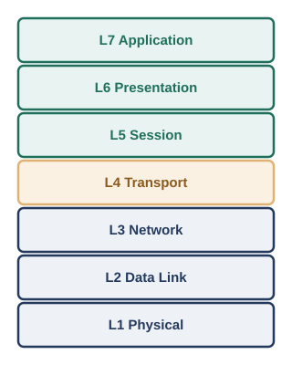
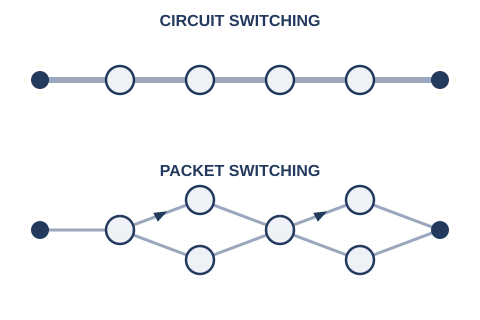

# 第1章　ネットワークの基礎知識

## 1.1　プロトコルとレイヤーという考え方

通信の手順を「プロトコル」として決めておき、役割ごとに独立した「層（レイヤー）」に分けて考える。これが、現代のネットワークを支える設計思想です。

序章では、2台のコンピュータがつながるたびに、新しい「取り決め」が必要になる様子を見てきました。信号が誰宛てかを区別するためのアドレス、衝突を避けるための順番のルール、宛先だけに届けるための対応表――どれも、複数の機械が「こうしましょう」と同じルールに従うことで、はじめて成立する仕組みでした。

このような、通信のために合意されたルールの集合を、プロトコル（protocol）と呼びます。プロトコルは1つとは限りません。実際の通信では、電気信号として0と1を送る仕組み、同じ配線上のどの機械宛てかを区別する仕組み、離れたネットワークまで届ける仕組み、届いたデータをどのアプリケーションに渡すかを区別する仕組みなど、性質の異なる課題が同時に発生します。これらすべてを1つの巨大なルールブックにまとめてしまうと、ケーブルを光ファイバに変えただけで、ルールブック全体を書き直す羽目になりかねません。

#### 層に分ける利点

- 役割ごとに問題を切り分けられる（「つながらない」原因を、配線の問題か、宛先の指定ミスかで切り分けられる）
- 層ごとに技術を入れ替えられる（無線LANを有線に変えても、その上の仕組みはそのまま使える）
- 標準化された「境界線（インターフェース）」さえ守れば、層の中身は別の会社・別の技術に置き換えてよい

そこで考え出されたのが、通信の課題を性質ごとに独立した「層」に分割し、各層は隣り合う層とだけ決まった約束事でやり取りする、という設計です。手紙にたとえるとわかりやすいかもしれません。手紙の中身（何を伝えるか）と、封筒に書く宛先（誰に届けるか）と、実際に配達する郵便網の仕組み（どうやって物理的に運ぶか）は、まったく別の関心事です。中身をどう書くかは、配達方法が郵便か宅配便かとは無関係に決められますし、逆に配達方法を変えても、手紙の書き方を変える必要はありません。ネットワークの世界でも同じように、「層」ごとに関心事を切り分けることで、一部分だけを独立に変更・改良できるようにしています。

## 1.2　OSI参照モデル

通信を7つの層に分けて整理した設計図が、OSI参照モデルです。実際のインターネットは、より簡略化した4層のモデルで動いていますが、「どの層の話をしているか」を共有する共通言語として、今でも広く使われています。

この「層に分ける」という考え方を、業界共通の枠組みとして整理したものが、OSI参照モデル（Open Systems Interconnection Reference Model）です。国際標準化機構（ISO）と国際電気標準会議（IEC）が共同で策定した国際規格ISO/IEC 7498-1として定義されており※1、通信の役割を次の7つの層に分けています。

<figure>

<figcaption>OSI参照モデルの7層構造</figcaption>
</figure>

#### 7つの層（下から順に）

- **L1 物理層**: 電気信号や光信号として、0と1をどう表現し、どう送るか（序章で見てきた、同軸ケーブルやより対線の話そのもの）
- **L2 データリンク層**: 同じ配線・同じ機器の中で、どのMACアドレス宛てかを区別する（第3章）
- **L3 ネットワーク層**: 離れたネットワークまで、IPアドレスをもとに経路を選んで届ける（第4章・第5章）
- **L4 トランスポート層**: どのアプリケーション宛てかを区別し、必要なら信頼性のある配送を保証する（第7章）
- **L5 セッション層**: 通信の開始から終了までの、一連のやり取りをまとめて管理する
- **L6 プレゼンテーション層**: 文字コードや暗号化・圧縮など、データの表現形式を扱う
- **L7 アプリケーション層**: Webページの閲覧やメールの送受信など、利用者が直接触れるアプリケーションの取り決め（第11章）

L1からL4までは、序章から本書がこれまで・これから積み上げていく内容と、ほぼそのまま対応しています。一方、L5〜L7は、実際のインターネットの世界では、OSI参照モデルほどきれいに3つの層へ分かれているわけではありません。インターネットの標準を定めるIETF（Internet Engineering Task Force）は、RFC 1122という文書の中で、実務上の通信を「リンク層」「インターネット層」「トランスポート層」「アプリケーション層」という4つの層で捉えるモデルを示しています※2。ここでは、OSIのセッション層・プレゼンテーション層に相当する役割は、独立した層としてではなく、それぞれのアプリケーション（たとえばHTTPSにおけるTLSなど）の中に組み込まれる形で実現されています。

つまり、OSI参照モデルは「実際にこの7層のソフトウェアが機械の中で動いている」という意味の設計図というより、「通信のどの部分の話をしているのか」を関係者どうしで共有するための、共通言語としての性格が強いモデルです。現場で「レイヤー3の障害です」「これはL2の問題ですね」といった言い方をするとき、話し手たちが思い浮かべているのは、まさにこのOSI参照モデルの層番号です。本書でも、この後の章でこの層番号を目印として使っていきます。

## 1.3　LANとWAN

限られた範囲・単一の組織が管理するネットワークがLAN、複数の拠点や組織をまたいで広がるネットワークがWANです。

序章で語ってきた物語は、すべて「1つの部屋」「1つの建物」というスケールの中で起きていました。同軸ケーブル、ダムハブ、L2スイッチ――これらは1つの組織が管理する、限られた範囲のネットワークの中の出来事です。このような、単一の建物・キャンパスなど限られた地理的範囲に閉じたネットワークを、LAN（Local Area Network、構内ネットワーク）と呼びます。

これに対して、序章の終盤で登場した「組織を越えてつながりたい」という欲求は、LANの外に踏み出す話でした。地理的に離れた複数の拠点や、異なる組織のネットワーク同士を結ぶ、より広い範囲のネットワークを、WAN（Wide Area Network、広域ネットワーク）と呼びます。自社の複数の拠点を専用線で結ぶ場合も、インターネットを経由してつながる場合も、LANとLANの間を橋渡しする部分はWANの領域です。

#### LANとWANの違い

- LAN: 1つの組織が自前で管理する、建物・フロア単位の狭い範囲
- WAN: 複数の拠点・複数の組織にまたがる、広い範囲。多くの場合、通信事業者（キャリア）の回線を借りて構築する
- 序章の物語は、ほぼ全編がLANの中の出来事。「組織を越えてつながる」からがWANの領域

序章で登場したIPアドレスとルータは、まさにこのLANとWANの境界で働く道具です。ルータは、自分の組織のLANと、外の世界（他のLAN、あるいはWAN）との橋渡し役を担います。この境界の具体的な仕組みは、第4章で改めて扱います。

## 1.4　クライアントサーバーとピアツーピア

サービスを提供する側とお願いする側の役割が固定されているのがクライアントサーバー方式、参加者全員が対等な立場でやり取りするのがピアツーピア（P2P）方式です。

序章では、ファイルを保管する係や印刷を取りまとめる係として、特定の1台のコンピュータがサービスを提供する側に回り、周囲のコンピュータがそれをお願いする側にまわる、という役割分担が生まれる様子を見てきました。サービスを要求する側をクライアント（client）、サービスを提供する側をサーバー（server）と呼び、この役割分担にもとづく通信のあり方を、クライアントサーバーモデルと呼びます。

クライアントサーバーモデルには、管理のしやすさという大きな利点があります。データやサービスが1か所（サーバー）に集約されているため、アクセス権の管理やバックアップ、セキュリティ対策を一元的に行えます。一方で、サーバーは貴重で単一の存在である分、そこが停止したり、想定を超えるアクセスが集中したりすると、サービス全体が影響を受けてしまうという弱点も抱えています。

#### 2つのモデルの対比

- クライアントサーバー: 役割が固定。管理しやすいが、サーバーに負荷や障害が集中しやすい
- ピアツーピア（P2P）: 全参加者が対等。参加者が増えるほど全体の処理能力も増えるが、特定のデータの所在や品質を保証しにくい

これとは異なる発想が、ピアツーピア（Peer-to-Peer、P2P）方式です。P2Pでは、あらかじめ決まったサーバーを置かず、参加者（ピア）全員が対等な立場で、互いにクライアントにもサーバーにもなります。たとえば、ファイル共有プロトコルであるBitTorrentでは、同じファイルをダウンロードしようとしている参加者同士が、自分がすでに持っている部分を互いにアップロードし合うことで、1つの配布元に負荷が集中せずに、多数の参加者へ効率よくファイルを行き渡らせる仕組みになっています※3。参加者が増えるほど、アップロードできる相手も増えるため、理屈のうえでは負荷が分散されていく、という特徴があります。ただし、特定のデータをどのピアが持っているかが常に変動するため、クライアントサーバーモデルほど単純にはデータの所在や可用性を保証できない、という難しさもあります。

## 1.5　2進数・16進数

コンピュータは電気信号のオン・オフ、つまり2つの状態だけで動いています。この2進数を人間が扱いやすいよう短くまとめて表記するのが、16進数です。

序章で振り返った同軸ケーブルやより対線の話は、結局のところ「電気信号がある状態」と「ない状態」、あるいは「電圧が高い状態」と「低い状態」という、2つの状態の組み合わせで情報をやり取りしていました。この2つの状態を0と1という数字に対応させ、位取り記数法で表現したものが、2進数（binary）です。2進数の1桁を、ビット（bit）と呼びます。

たとえば2進数の`1101`は、右から順に1の位・2の位・4の位・8の位を表しており、`8+4+0+1=13`、つまり10進数の13にあたります。8個のビットをひとまとめにしたものを、バイト（byte）と呼び、コンピュータが情報をやり取りする基本単位として広く使われています。

ただし、2進数は桁数が多くなりがちで、人間が読み書きするには不便です。そこで使われるのが、16進数（hexadecimal）です。16進数が便利なのは、ちょうど4ビット（2進数4桁）が、16進数のきっちり1桁に対応するという性質があるからです。

#### 4ビットと16進数1桁の対応

| 2進数 | 10進数 | 16進数 | 2進数 | 10進数 | 16進数 |
|---|---|---|---|---|---|
| 0000 | 0 | 0 | 1000 | 8 | 8 |
| 0001 | 1 | 1 | 1001 | 9 | 9 |
| 0010 | 2 | 2 | 1010 | 10 | A |
| 0011 | 3 | 3 | 1011 | 11 | B |
| 0100 | 4 | 4 | 1100 | 12 | C |
| 0101 | 5 | 5 | 1101 | 13 | D |
| 0110 | 6 | 6 | 1110 | 14 | E |
| 0111 | 7 | 7 | 1111 | 15 | F |

この性質のおかげで、1バイト（8ビット）はちょうど16進数2桁で表せます。たとえば2進数`11000000`は、上位4ビット`1100`（16進数C）と下位4ビット`0000`（16進数0）に分けて、16進数`C0`と書けます。これは、後の章で登場するサブネットマスクの`255`（2進数`11111111`、16進数`FF`）や、MACアドレス・IPv6アドレスの表記など、ネットワークのさまざまな場面で使われる書き方です。10進数に変換するより、2進数と16進数を行き来するほうが、ビットのまとまりを直感的に把握しやすい、という理由から広く使われています。

## コラム：回線交換とパケット交換（豆知識、読み飛ばし可）

序章で語ってきたのは、1つの建物の中で機械同士をつなぐ話でしたが、少し目を広げて、電話網とインターネットの違いにも触れておきましょう。

従来の電話網は、回線交換（circuit switching）という方式で動いていました。電話をかけると、発信者と相手の間に、通話が終わるまで占有し続ける専用の経路が確保されます。この経路は、たとえ会話の合間の沈黙の時間であっても、他の誰かに使われることなく確保されたままです。経路さえ確保できれば、通話品質は安定しますが、経路を使っていない時間も含めて占有してしまうため、大勢が同時に通信しようとすると効率がよくありません。

<figure>

<figcaption>回線交換は経路を占有し続け、パケット交換は小分けにしたデータがそのつど経路を選ぶ</figcaption>
</figure>

これに対して考え出されたのが、パケット交換（packet switching）という発想です。送りたいデータを小さな単位（パケット）に分割し、それぞれのパケットに宛先の情報を持たせて、ネットワークの中を1つずつ送り出す。各パケットがどの経路を通るかは、そのつど決まってよく、途中の一部が混雑していたり故障していたりしても、別の経路に回り込める、という柔軟性を持っています。

パケット交換という発想は、1960年代にアメリカのランド研究所のポール・バランと、イギリスの国立物理学研究所のドナルド・デイビスによって、それぞれ独立に考え出されました。バランは、軍事通信網が一部を攻撃されても機能し続けられるようにする、という「生き残れる通信網」の研究の中でこの発想にたどり着き、1964年の研究報告書としてまとめています※4。この報告書は、後にARPANET（インターネットの前身となった実験的ネットワーク）の設計にも影響を与え、今わたしたちが使っているインターネットの土台になりました。序章で見てきた「1本のケーブルが切れると全体が止まる」という共有バスの弱点と同じように、通信網全体をいかに壊れにくくするか、という問いが、ここでも大きな原動力になっていたのです。

## 参考文献

- ※1: ISO/IEC 7498-1:1994, *Information technology — Open Systems Interconnection — Basic Reference Model: The Basic Model* — https://www.iso.org/standard/20269.html
- ※2: RFC 1122, *Requirements for Internet Hosts -- Communication Layers* — https://www.rfc-editor.org/rfc/rfc1122
- ※3: BEP 0003, *The BitTorrent Protocol Specification* — https://www.bittorrent.org/beps/bep_0003.html
- ※4: Paul Baran, *On Distributed Communications: I. Introduction to Distributed Communications Networks*, RAND Corporation, RM-3420-PR, 1964 — https://www.rand.org/pubs/research_memoranda/RM3420.html

