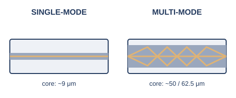

# 第2章　物理層 ― ケーブルと電波

## 2.1　伝送媒体の種類（メタル／光／無線）

信号を運ぶ媒体には、大きく分けて銅線（メタル）、光ファイバ、無線（電波）の3種類があります。

序章では、同軸ケーブルからより対線へと、電気信号を運ぶ銅線（メタルケーブル）の話を中心に見てきました。電気信号は、電圧の高い/低い、あるいは電流の有無で0と1を表現します。銅線は安価で扱いやすい反面、信号が電気である以上、周囲の電磁波（モーターや蛍光灯、他のケーブルなど）の影響を受けやすく、また距離が伸びるほど信号が減衰していく、という制約を抱えています。

#### 3種類の伝送媒体

- **メタル（銅線）**: 安価で扱いやすいが、電磁ノイズの影響を受けやすく、距離の制約も大きい
- **光ファイバ**: 電気ではなく光（光のパルス）で信号を送るため、電磁ノイズの影響を受けず、非常に長い距離まで届く。ただしケーブル・機器のコストは高め
- **無線（電波）**: ケーブルそのものが不要。設置の自由度は高いが、電波は空間を共有するため、他の電波との干渉や、距離・障害物による減衰を受けやすい

これに対して、光ファイバは電気の代わりに光（レーザーやLEDによる光のパルス）で信号を送ります。光は電磁ノイズの影響を受けないため、銅線よりはるかに長い距離を安定して届けられます。ただし、光を送受信するための機器やケーブルの加工には相応のコストがかかります。

無線（電波）は、ケーブルという物理的な制約そのものから解放される伝送媒体です。設置の自由度は高い一方、電波という「空間」を複数の機器で共有することになるため、他の電波との干渉や、障害物・距離による減衰の影響を強く受けます。この後の節では、メタルケーブル（2.2）、光ファイバ（2.3）、無線LAN（2.5）について、それぞれもう少し詳しく見ていきます。

## 2.2　LANケーブルのカテゴリと選び方（Cat5e/6/6A、10Gを確実に飛ばすには）

より対線のケーブルには「カテゴリ」という規格があり、数字が大きいほど、より高速な通信に、より確実に対応できます。

序章で見てきたより対線（RJ45で接続するケーブル）には、「カテゴリ（Cat）」という規格による格付けがあります。カテゴリの数字が大きいほど、対応する周波数帯域が広く、より高速な通信を安定して通せます。

#### 主なカテゴリの違い

| カテゴリ | 対応帯域 | 1Gbps | 10Gbps |
|---|---|---|---|
| Cat5e | 100MHz | 100m | 非対応 |
| Cat6 | 250MHz | 100m | 55mまで※1 |
| Cat6A | 500MHz | 100m | 100m※1 |

ここで実務上とくに注意したいのが、Cat6とCat6Aの違いです。Cat6は10Gbpsの通信（10GBASE-T）にも対応してはいますが、その対応距離はケーブル配線の規格上限とされる100mよりずっと短い、55m程度に制限されます※1。オフィスのフロア配線のように、決まった長さのケーブルを壁の中に通してしまっている環境で「あとから10Gに増速したい」と思っても、Cat6配線のままでは100mの距離を確実に10Gbpsで通せる保証がありません。10Gbpsを100mの距離で確実に飛ばしたいなら、帯域を倍の500MHzに強化したCat6Aを選んでおくのが安全です。

## 2.3　光ファイバの基礎（シングル/マルチモード、コネクタ、距離）

光ファイバには、芯（コア）の太さによって、シングルモードとマルチモードの2種類があり、それぞれ得意な距離が異なります。

光ファイバは、中心にある芯（コア）を光が通り抜けることで信号を伝えます。このコアの太さによって、光ファイバは大きく2種類に分かれます※2。

<figure>

<figcaption>シングルモードは光が1本の経路のみを、マルチモードは複数の経路を通る</figcaption>
</figure>

シングルモードファイバは、コアの直径が9マイクロメートル程度と非常に細く、光がほぼ1本の経路（モード）しか通れません。経路が1本に絞られるため、複数の経路を通った光が到着時刻のずれを起こす現象（モード分散）が起きず、非常に長い距離まで信号を届けられます。長距離の基幹回線や、通信事業者の回線などで使われます。

マルチモードファイバは、コアの直径が50マイクロメートルや62.5マイクロメートルと太く、光が複数の経路で反射しながら進みます。経路ごとに光の到着時刻がわずかにずれるモード分散が起こるため、シングルモードほど長距離には向きませんが、発光素子（LED等）が安価に作れるため、機器・ケーブルのコストを抑えられます。建物内やデータセンター内など、比較的短い距離の配線でよく使われます。

コネクタにはいくつかの種類がありますが、現在よく使われるのはLCコネクタ（SCの半分程度と小型）と、やや大きめのSCコネクタ（押し込んで固定するタイプ）です。どちらもシングルモード・マルチモードの両方に対応しています※2。

## 2.4　ネゴシエーションという仕組み（1Gと10Gの違い）

接続した機器同士が、自動的にお互いの対応速度や通信方式をすり合わせる仕組みが、オートネゴシエーションです。

序章の終盤で、より対線が1対を送信専用・1対を受信専用に使い分けることで全二重が実現した、という話をしました。ただし、接続する2台の機器が「本当に同じ速度・同じ全二重で通信してよいか」を、あらかじめ人間が設定しておく必要があるとしたら、大変面倒です。

この調整を自動で行う仕組みが、オートネゴシエーション（自動ネゴシエーション）です。IEEE 802.3規格のClause 28として定義されており、ケーブルを挿した瞬間、両端の機器がFLP（Fast Link Pulse）と呼ばれる特別な信号のやり取りを通じて、自分が対応できる速度・全二重/半二重の組み合わせを相手に伝え合います。そのうえで、双方が対応できる中で最も高性能な組み合わせを自動的に選びます※3。

#### オートネゴシエーションの実務上の注意点

- 片方の機器だけを手動で特定の速度・全二重/半二重の設定に固定すると、もう片方は自動判定に失敗し、速度や全二重/半二重の食い違い（デュプレックスミスマッチ）が起きることがある
- 症状は「つながってはいるが、やたら遅い」「エラーが増える」といった分かりにくい形で現れやすい
- 基本的には両端とも自動（オート）のままにしておくのが無難

10Mbps・100Mbpsの時代は、オートネゴシエーションはあくまで任意の機能で、両端を手動で固定することもできました（だからこそ、片方だけ固定してしまうデュプレックスミスマッチ事故が起きたのです）。これに対し、1Gbps以上の規格（1000BASE-Tや10GBASE-Tなど）では、そもそもオートネゴシエーションによる速度合わせが必須の仕組みとして組み込まれており、手動で固定するという選択肢自体が用意されていません。

実務では、スイッチのCLI上に「速度1000Mbps・全二重」のような設定コマンドが用意されていることがあります。これは、ネゴシエーションの仕組みそのものを止めているのではなく、申告する候補を1つに絞り込んでいるだけです※4。ごく一部の古い機器では、この設定によって本当にネゴシエーションが無効化され、規格から外れた挙動になることもあります。

## 2.5　無線LAN規格の変遷（Wi-Fi 4→7、理論値の推移）

無線LANの規格は「Wi-Fi 4」のように世代番号で呼ばれるようになり、世代を追うごとに理論上の最大速度が大きく伸びてきました。

無線LANの規格は、本来IEEE 802.11の後ろに付くアルファベット（802.11n、802.11acなど）で区別されていましたが、一般の利用者には分かりにくいため、業界団体のWi-Fi Allianceが「Wi-Fi 4」のような世代番号による呼び方を導入しました。この番号は802.11n以降にさかのぼって付け直されたものです※5。

#### 主な世代と特徴

- **Wi-Fi 4（802.11n、2009年）**: 2.4GHz帯・5GHz帯の両方に対応し、理論値で最大600Mbps
- **Wi-Fi 5（802.11ac、2013年）**: 5GHz帯に特化し、理論値で最大約6.9Gbps
- **Wi-Fi 6（802.11ax、2021年）**: OFDMA（複数端末への効率的な帯域の割り当て）やTWT（省電力機能）により、理論値で最大約9.6Gbpsに加え、混雑した環境での実効性能を重視
- **Wi-Fi 6E**: Wi-Fi 6の技術をそのままに、対応周波数帯を6GHz帯まで拡張
- **Wi-Fi 7（802.11be、2024年）**: 複数の周波数帯を同時に束ねて使うマルチリンク動作により、理論値で最大約46Gbps

ここで挙げた理論値は、いずれも実験室環境での最大値です※5。実際の通信速度は、電波の届く距離、障害物、同時に接続している端末の台数、周囲の電波干渉など、さまざまな要因で理論値より大きく下がります。世代を追うごとに理論値が伸びているのは事実ですが、「Wi-Fi 6だから必ず速い」とは限らない、という点には注意が必要です。

## 2.6　PoE（Power over Ethernet）

PoE（Power over Ethernet）は、データ通信に使うのと同じLANケーブルを使って、電力も一緒に送ってしまう仕組みです。

より対線には4対の線があり、通信規格によっては2対しか使わない、という話を序章でしました。PoEは、まさにこの「空いている2対」に直流電力を流すか、あるいはデータで使っている対に電力を重畳させる（信号と電力を同じ線に同時に乗せる）ことで、通信と同時に電力を送り届けています。電力を送り出す側（スイッチやPoE対応の電源装置）をPSE（Power Sourcing Equipment）、電力を受け取る側（IP電話や無線LANのアクセスポイント、防犯カメラなど）をPD（Powered Device）と呼びます。PoEを使えば、PDの近くにコンセントがなくても、LANケーブル1本で通信と給電を同時にまかなえます。

#### PoE規格と電力

| 規格 | 通称 | PSE側の供給電力 | PD側の受電電力 |
|---|---|---|---|
| IEEE 802.3af | PoE | 約15.4W | 約12.95W |
| IEEE 802.3at | PoE+ | 約30W | 約25.5W |
| IEEE 802.3bt Type 3 | PoE++ | 約60W | 約51W |
| IEEE 802.3bt Type 4 | PoE++ | 約90W | 約71.3W |

世代が進むほど、供給できる電力は大きくなっています※6。PSE側の供給電力とPD側の受電電力に差があるのは、ケーブルの途中で電力の一部が失われることをあらかじめ見込んだ規格になっているためです。

スイッチには、PoEポート1つあたりの上限とは別に、スイッチ全体としての「電力予算」が決められています。たとえば1台のスイッチの総電力予算が370Wだった場合、PoE++対応の高出力カメラを何台も接続していくと、各ポートの上限（60W等）以内に収まっていても、スイッチ全体の予算を使い切ってしまうことがあります。この場合、あるポートに機器をつないでも電源が入らなかったり、既存の機器が突然給電を止められたりする、という分かりにくい現象が起こります。PoE機器を増設する際は、ポート単位の上限だけでなく、スイッチ全体の電力予算にも余裕があるかを確認する必要があります。

クラウドを利用しているとき、わたしたちがどんな種類のケーブルや光ファイバの上で通信しているかを意識することは、ほとんどありません。物理層の管理は、データセンターを運用するクラウド事業者側の責任範囲だからです。それでも物理層の影響がまったく見えなくなるわけではなく、たとえば「利用者に近いリージョンを選ぶと通信の遅延が小さくなる」「仮想ネットワークのゲートウェイに帯域の上限プランがある」といった形で、物理的な距離や回線容量の制約が、サービスの選択肢として間接的に姿を現します。

## 参考文献

- ※1: *Ethernet Cable Standards Explained: TIA-568, Cable Categories, and the Truth About CAT6E* — Vertical Cable — https://verticalcable.com/blog/ethernet-cable-standards-explained
- ※2: *Ethernet physical layer* — Wikipedia — https://en.wikipedia.org/wiki/Ethernet_physical_layer
- ※3: *Autonegotiation* — Wikipedia — https://en.wikipedia.org/wiki/Autonegotiation
- ※4: Cisco, *Configure and Verify Ethernet 10/100/1000Mb Half/Full Duplex Auto-Negotiation* — https://www.cisco.com/c/en/us/support/docs/lan-switching/ethernet/10561-3.html
- ※5: *The Evolution of Wi-Fi Technology and Standards* — IEEE Standards Association — https://standards.ieee.org/beyond-standards/the-evolution-of-wi-fi-technology-and-standards/
- ※6: *Power over Ethernet Standards (802.3af, 802.3at, & 802.3bt)* — NVT Phybridge — https://www.nvtphybridge.com/power-over-ethernet-standards/

