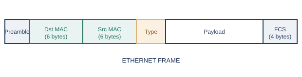
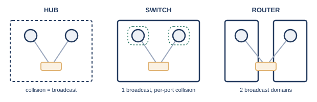

# 第3章　データリンク層とスイッチング

## 3.1　MACアドレスとフレーム

すべてのネットワーク機器には、世界で重複しない48ビットの識別番号「MACアドレス」が割り当てられており、通信の最小単位である「フレーム」の中に、宛先・送信元として書き込まれます。

序章では、複数の機械を区別するために「アドレス」という発想が生まれる様子を見てきました。データリンク層（L2）で使われるこのアドレスを、正式にはMACアドレス（Media Access Control address）と呼びます。MACアドレスは48ビット（6バイト）の数値で、第1章で扱った16進数を使い、`00:1A:2B:3C:4D:5E`のように、2桁の16進数を6組並べて表記します。

#### MACアドレスの内訳

- 前半24ビット（3バイト）: OUI（Organizationally Unique Identifier）。IEEE Registration Authorityが、製造元の企業ごとに割り当てる識別子※1
- 後半24ビット（3バイト）: 製造元が自社の製品ごとに割り振る、重複しないシリアル番号
- 前半（誰が作ったか）と後半（どの個体か）の組み合わせにより、世界中のあらゆる機器のMACアドレスが重複しないようになっている

このMACアドレスを使って、データリンク層でやり取りされるデータの単位を、フレーム（frame）と呼びます。序章で「信号」と呼んでいたものの正体は、実際にはこのフレームという構造を持ったデータのかたまりです。

<figure>

<figcaption>イーサネットフレームの基本構造</figcaption>
</figure>

フレームの先頭には、受信側が同期を取るためのプリアンブルが置かれ、続いて宛先MACアドレス・送信元MACアドレスが並びます。序章で見た「宛先が自分あてかどうかを確認して、違えば黙って捨てる」という仕組みは、まさにこの宛先MACアドレスを見て行われています。そのすぐ後ろにあるタイプ（EtherType）フィールドは、続くペイロードがどの上位プロトコルのデータなのかを示す2バイトの値で、たとえば`0x0800`はIPv4、`0x0806`はARPを表します。受信側はこの値を見て、フレームの中身をどのプロトコルの処理へ渡せばよいかを判断します。その後にペイロード（実際に運びたいデータ）が続き、最後にFCS（Frame Check Sequence）という誤り検出符号が付きます。受信側は、届いたフレームからFCSを計算し直し、値が一致するかどうかで、通信中にデータが壊れていないかを確認します※2。

## 3.2　スイッチ／ハブの役割

ハブは受け取った信号を全ポートにそのまま流すだけの単純な機械、スイッチは宛先MACアドレスを見て必要なポートだけに転送する、賢い機械です。

序章で見てきたとおり、ダムハブ（リピーターハブ）は、受け取った電気信号を、つながっている全員にそのまま送り出すだけの単純な機械でした。これはOSI参照モデルでいうL1（物理層）の働きにとどまり、フレームの中身を一切見ていません。

これに対してL2スイッチは、届いたフレームの宛先MACアドレスを読み取り、そのMACアドレスがどのポートの先にいるかを記録した対応表（MACアドレステーブル）と照らし合わせて、該当する1つのポートだけにフレームを転送します。この対応表は、各ポートに届いたフレームの送信元MACアドレスを見るたびに、「このアドレスはこのポートの先にいる」と自動的に学習していく仕組みになっています。ハブがL1の単純な繰り返し装置であるのに対し、スイッチはL2の情報（MACアドレス）をもとに判断する、賢い機械だといえます。

## 3.3　コリジョンドメインとブロードキャストドメイン

信号がぶつかり合う可能性のある範囲がコリジョンドメイン、ブロードキャスト（宛先を指定しない一斉送信）が届く範囲がブロードキャストドメインです。

序章で「コリジョンドメイン」という言葉が先出しされていたのを覚えているでしょうか。ここで、この言葉の正式な意味を整理しておきましょう。

コリジョンドメインとは、複数の機器が信号を同時に送り出したときに、衝突が起こりうる範囲のことです。ダムハブにつながる機器は全員が信号を共有するため、ハブにつながる範囲全体が1つのコリジョンドメインになります。一方、L2スイッチは、ポートごとに信号を電気的に分離するため、スイッチの各ポートがそれぞれ独立したコリジョンドメインになります。

これとは別に、ブロードキャストドメインという範囲もあります。ブロードキャストとは、宛先を特定の1台に絞らず、その範囲にいる全員に一斉送信する通信方式のことです。ブロードキャストドメインとは、あるブロードキャストが実際に届く範囲を指します。ここで重要なのは、L2スイッチはコリジョンドメインをポートごとに分割しても、ブロードキャストドメインまでは分割しない、という点です。スイッチにつながる機器はすべて、依然として1つのブロードキャストドメインに属しています。ブロードキャストドメインを分割できるのは、L3（ネットワーク層）で動作するルータだけです※3。

<figure>

<figcaption>ハブ・スイッチ・ルータで、コリジョンドメインとブロードキャストドメインの分かれ方が異なる</figcaption>
</figure>

#### 3つの機器の違い

- ハブ: コリジョンドメイン＝ブロードキャストドメイン。両方とも1つにまとまったまま
- スイッチ: コリジョンドメインはポートごとに分割される。ブロードキャストドメインは1つのまま
- ルータ: ブロードキャストドメインも分割される。ルータの各インターフェースが、別々のブロードキャストドメインの境界になる

## 3.4　ダムハブ→CSMA/CD→L2スイッチ→全二重化

序章で語ってきた物語を、ここで技術用語として整理し直しておきましょう。

序章では、同軸ケーブルによるバス配線から始まり、トークンバス・トークンリング、そしてCSMA/CDという「順番を待たない」発想を経て、ダムハブとL2スイッチ、より対線による全二重化へと至る流れを、物語として追いかけてきました。この章で登場した用語を使って、その流れを技術的に整理し直すと、次のようになります。

#### 用語で振り返る序章の流れ

- ダムハブ: L1（物理層）で電気信号をそのまま繰り返す装置。全ポートが1つのコリジョンドメイン
- CSMA/CD: L2（データリンク層）で、コリジョンドメインを共有する複数の機器が衝突を検知・回避するための取り決め（IEEE 802.3）
- L2スイッチ: MACアドレステーブルにもとづき、ポートごとにコリジョンドメインを分割する装置
- 全二重化: より対線の送信専用対・受信専用対を活かし、1ポート1台の構成と組み合わさることで、コリジョンドメインという概念そのものが実質的に不要になった状態

つまり、序章で描かれた技術の変遷は、「コリジョンドメインをどう扱うか」という1本の軸で説明できます。最初はコリジョンドメインをみんなで共有し、譲り合いのルール（CSMA/CD）でしのいでいた状態から、スイッチによってコリジョンドメインを1ポート単位まで小さくし、最終的には全二重化によってコリジョンドメインという概念自体が意味を持たなくなる状態へと進化してきた、というのが、この章までの技術的な結論です。

## 3.5　なぜループ対策が必要か（STPの目的と、STPに頼らない設計）

スイッチを冗長化のために複数のケーブルでループ状につなぐと、ブロードキャストフレームが永遠に回り続ける「ブロードキャストストーム」が起こります。これを防ぐのが、STP（スパニングツリープロトコル）です。

第9章で改めて扱いますが、ネットワークの信頼性を高めるために、スイッチ同士を複数のケーブルで冗長に接続したくなる場面があります。ところが、L2の世界でスイッチ同士を単純にループ状につなぐと、深刻な問題が起こります。

ブロードキャストフレームは、受け取ったスイッチがすべてのポートへ転送する仕組みです。ループ状の配線があると、あるスイッチが転送したブロードキャストフレームが、別の経路を回って同じスイッチに戻ってきてしまい、そこでまた全ポートへ転送される――これが際限なく繰り返されます。この現象をブロードキャストストームと呼び、ネットワーク帯域を瞬く間に食いつぶし、実質的に通信不能な状態に陥ります。

この問題を防ぐために考え出されたのが、STP（Spanning Tree Protocol、スパニングツリープロトコル）です。IEEE 802.1Dとして標準化されており※4、スイッチ同士が情報をやり取りして、ネットワーク全体の中から「木構造（ツリー）」、つまりループのない経路だけを選び出します。ループを作る余分な経路にあたるポートは、通常時は論理的に閉じて（ブロッキング状態にして）通信に使わないようにしつつ、選ばれた経路に障害が起きたときには、閉じていたポートを開いて経路を自動的に切り替えます。冗長性（複数の物理的な経路）を保ちながら、論理的にはループのない1本の木構造だけを使う、という発想です。

#### STPの弱点と、それに頼らない設計

- STPは、障害発生時にブロッキングされていたポートを開くまでに、一定の切り替え時間がかかる
- この切り替え時間の間は通信が途切れるため、より高速な切り替えを求める環境では不向きな場合がある
- そのため近年は、L2のループとSTPに頼るのではなく、後述する冗長化技術（LAGなど、第9章）や、そもそもL2のループが生じない構成（L3による設計）を優先する考え方も広がっている

STPそのものの詳しい設定方法には立ち入りませんが、「なぜループを避ける必要があるのか」「なぜ冗長化とループ回避を両立させる仕組みが必要になるのか」という背景は、第9章で扱う冗長化技術を理解するうえでの土台になります。

## 参考文献

- ※1: *IEEE Registration Authority (MA-L / OUI)* — IEEE Standards Association — https://standards.ieee.org/products-programs/regauth/oui/
- ※2: *Ethernet IEEE 802.3 Frame Format / Structure* — Electronics Notes — https://www.electronics-notes.com/articles/connectivity/ethernet-ieee-802-3/data-frames-structure-format.php
- ※3: *Collision Domain vs. Broadcast Domain* — Baeldung on Computer Science — https://www.baeldung.com/cs/collision-broadcast-domains
- ※4: *What is IEEE 802.1D? Spanning Tree Protocol (STP) & Bridging Explained* — Comms InfoZone — https://www.comms-express.com/infozone/article/802-1d/

