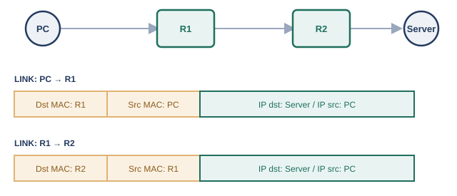
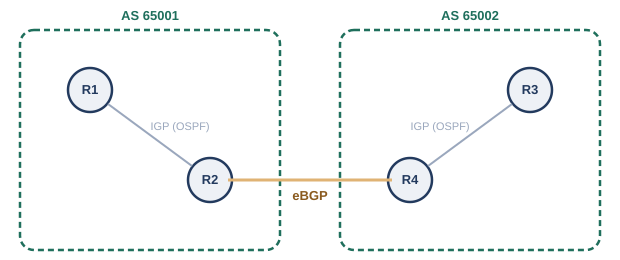

# 第5章　ルーティング

## 幕間　経路が増えて面倒になった話

前の章までで見てきたルータは、まだ1〜2台程度の、こぢんまりとしたネットワーク同士をつなぐ役回りでした。ところが、つながる相手が増えてくると、様子が変わってきます。

拠点が増え、ルータが3台、4台と増えていくと、「どのネットワーク宛てのパケットは、どのルータに投げればよいか」という経路の情報を、管理者が1つずつ手作業で設定し続けなければならなくなります。ルータが1台増えるたびに、既存のルータすべての設定を見直す必要が出てくることもあり、経路が増えるほど、この作業はどんどん面倒になっていきます。

さらに話は社内にとどまりません。組織同士がインターネットでつながり合うようになると、自分の組織の中だけで完結しないネットワーク同士の付き合い方も必要になってきます。大学同士、企業同士が回線を持ち寄り、IX（Internet Exchange、インターネットエクスチェンジ）と呼ばれる相互接続点に集まって経路をやり取りする、という光景も生まれました。

こうして、ネットワークは大学や企業といった組織の垣根を越えて、世界規模でつながる1つの大きな集合体へと育っていきます。この章では、「経路を自動で管理する仕組み」と、「組織をまたいで経路をやり取りする仕組み」の両方を見ていきます。

## 5.1　ルーティングテーブルの仕組み

ルータは、パケットの宛先IPアドレスを見て、「次にどのルータ（または機器）へ渡せばよいか」をルーティングテーブルという表で判断しています。

第4章で見たように、宛先が別のネットワークにある通信は、デフォルトゲートウェイであるルータに預けられます。では、そのルータは預かった荷物をどこへ送ればよいのでしょうか。ルータは内部に、ルーティングテーブル（経路表）と呼ばれる一覧を持っており、そこに書かれた情報をもとに転送先を決めています。

#### ルーティングテーブルの主な項目

- 宛先ネットワーク: `192.168.10.0/24`のような、CIDR表記のネットワークアドレス
- ネクストホップ: そのネットワーク宛ての通信を、次にどの機器（多くは隣接するルータ）に渡すか
- 出力インターフェース: どの物理的な（または論理的な）出口から送り出すか

ある宛先IPアドレスが、ルーティングテーブル上の複数のエントリに部分的に一致することもあります。たとえば`192.168.10.5`という宛先は、`192.168.0.0/16`にも`192.168.10.0/24`にも当てはまります。このような場合、ルータはより長いプレフィックス（より狭い範囲を指す、より詳細なエントリ）を優先します。これをロンゲストプレフィックスマッチ（最長一致）と呼びます。

<figure>

<figcaption>ホップを重ねてもIPアドレスは変わらず、MACアドレスだけが1区間ごとに書き換わる</figcaption>
</figure>

第4章の終わりで触れた「IPアドレスが旅全体の最終目的地を、MACアドレスがそのときどきの次の1歩を指し示す」という関係は、ルータが何台連なっても変わりません。ルータは受け取ったパケットのIPアドレスはそのままに、ルーティングテーブルを引いてネクストホップを決め、そのネクストホップ宛ての新しいフレーム（宛先MACアドレスを次のホップのものに書き換えたフレーム）に包み直して送り出しているのです。

## 5.2　スタティックルーティングとデフォルトルート

管理者があらかじめ経路を1つずつ手で設定しておく方式が、スタティックルーティング（静的経路制御）です。

ルーティングテーブルへの経路の登録方法には、大きく分けて2種類あります。1つは、管理者が「このネットワーク宛てなら、このネクストホップへ」という情報を、コマンドなどで1つずつ手作業で登録する方法です。これをスタティックルーティングと呼びます。拠点数が少なく、ネットワーク構成があまり変化しない環境では、シンプルで見通しがよい方法です。

スタティックルーティングでよく使われる仕組みに、デフォルトルートがあります。ルーティングテーブルのどのエントリにも一致しない宛先が現れたとき、代わりに使われる「その他すべて」用のエントリで、`0.0.0.0/0`という、あらゆるIPアドレスに一致する特別なネットワーク表記で登録します。多くの場合、インターネット向けの出口となるルータへのネクストホップとして設定され、「知らない宛先は、とりあえずここに投げておけばよい」という役割を果たします。

## 5.3　ダイナミックルーティングという考え方

経路情報をルータ同士が自動でやり取りし合い、ルーティングテーブルを自動的に構築・更新する仕組みが、ダイナミックルーティング（動的経路制御）です。

冒頭の幕間で見たとおり、ルータの台数が増えるほど、スタティックルーティングの手作業には限界が見えてきます。設定漏れや入力ミスが起きやすくなるだけでなく、どこかの回線が切れて経路が使えなくなったときも、管理者が気づいて手動で経路を書き換えるまで、通信は復旧しません。

そこで登場するのが、ルータ同士がお互いの持つ経路情報を自動的に交換し合い、ネットワーク全体の変化に応じてルーティングテーブルを自ら更新していく、ダイナミックルーティングという仕組みです。ダイナミックルーティングを実現する具体的な手順（プロトコル）にはいくつかの方式があり、大きくは次の2つの考え方に分けられます。

#### ダイナミックルーティングの2つの考え方

- ディスタンスベクタ型: 隣接するルータに「このネットワークまでの距離（ホップ数など）」を教え合い、伝言ゲームのように経路情報を伝播させる
- リンクステート型: すべてのルータが、ネットワーク全体の接続構成（トポロジー）そのものを把握し、各ルータが自分自身で最短経路を計算する

次の5.4節で扱うOSPFは、後者のリンクステート型の代表例です。

## 5.4　OSPFの基本的な特徴（設定・エリア設計は扱わない）

OSPF（Open Shortest Path First）は、組織内のネットワーク（1つの管理単位）で広く使われている、リンクステート型のダイナミックルーティングプロトコルです。

OSPFの現行仕様は、1998年にRFC 2328として標準化されています※1。隣接するルータ同士がHelloパケットと呼ばれるメッセージを定期的にやり取りして互いの存在を確認し合い、その後、ネットワーク全体の接続構成の情報（リンクステート情報）を、すべてのルータに行き渡らせます。

#### OSPFの特徴

- リンクステート型: 各ルータが、ネットワーク全体の接続構成を把握したうえで、自分自身で最短経路を計算する（計算にはダイクストラ法というアルゴリズムを使う）
- コストというメトリック: 回線の帯域幅などをもとにした「コスト」の合計が最も小さい経路を、最短経路として選ぶ
- 収束が速い: 経路に変化があった場合、その変化の情報だけをすぐに周囲へ伝えるため、経路表が新しい状態に落ち着くまでの時間が短い
- IGP（Interior Gateway Protocol）: 1つの組織・1つの管理者が管理する範囲（後述するAS）の「内部」で使うことを想定したプロトコル

OSPFには、大規模なネットワークを複数の「エリア」に分割し、経路情報の伝播範囲を制限することで負荷を抑える仕組みも用意されています（すべてのエリアは、バックボーンと呼ばれる「エリア0」を中心に接続される、という設計です）。ただし、エリア設計や実際の設定手順は本書の範囲を超えるため、ここでは「そういう仕組みがある」という程度に留めておきます。

## 5.5　組織間接続からBGPへ（iBGP/eBGP、比較優位性）

異なる組織同士のネットワーク（AS）をつなぐには、OSPFのような組織内向けのプロトコルではなく、組織間の経路交換に特化したBGPというプロトコルが使われます。

OSPFは、1つの組織が管理する範囲の内部で使うプロトコルでした。では、大学と大学、企業とインターネットサービスプロバイダ（ISP）のように、それぞれ独立して管理されている組織同士のネットワークをつなぐときは、どうすればよいのでしょうか。

ここで登場するのが、AS（Autonomous System、自律システム）という単位です。ASとは、単一の技術的な管理下に置かれ、内部では共通のルーティング方針（OSPFのようなIGP）で経路を制御しているネットワークのまとまりを指し、それぞれのASには、世界で重複しないAS番号が割り当てられます※2（本書の例で使う`65001`のような番号は、実運用でも試験・社内利用向けに予約されているプライベートAS番号の範囲です）。組織同士のネットワークをつなぐということは、つまり異なるASをつなぐということです。

異なるASの間では、それぞれの組織が独自の運用方針（どの相手を優先してよいか、どの経路は使いたくないか、など）を持っているため、OSPFのような単純な「コストが一番小さい経路を選ぶ」だけでは不十分です。そこで、AS間の経路交換専用に設計されたBGP（Border Gateway Protocol）というプロトコルが使われます※3。BGP自体は1989年に最初のバージョンが標準化されており、現在広く使われているBGP-4は1994年に初めて標準化された後、2006年にRFC 4271として改訂されています。

#### iBGPとeBGP

- eBGP（external BGP）: 異なるAS同士の境界ルータの間で経路をやり取りする
- iBGP（internal BGP）: 同じASの中で、BGPの経路情報をルータ間で伝達するために使う

<figure>

<figcaption>AS内部はIGP、AS間はeBGPという役割分担</figcaption>
</figure>

OSPFが「コストという単一の物差しで、最短経路を機械的に選ぶ」ことを得意とするのに対し、BGPは「経路そのものの情報（経由するASの並びなど）をもとに、組織ごとの事情に応じて経路を選び分けられる」という、方針（ポリシー）に基づいた柔軟な経路選択を得意とします。この違いこそが、OSPFのようなIGPと、BGPのようなEGP（Exterior Gateway Protocol）を使い分ける理由です。冒頭で触れたIXは、まさにこの多数のASが集まってBGPで経路をやり取りする、物理的・論理的な集合場所として機能しています。

クラウドが提供するルートテーブル（Azureのルートテーブル、AWSのルートテーブルなど）も、宛先ネットワークとネクストホップの組み合わせで経路を管理するという、この章で見た考え方をそのまま踏襲しています。また、オンプレミス環境とクラウドを専用線でつなぐAzure ExpressRouteやAWS Direct Connectでは、双方の境界ルータの間でeBGPセッションを確立し、経路情報を交換する構成が広く使われています※4※5。オンプレミスとクラウドという異なる管理単位をBGPでつなぐという意味で、この章で見たAS間接続と同じ発想の延長線上にあります。

## 参考文献

- ※1: RFC 2328, *OSPF Version 2* — https://www.rfc-editor.org/rfc/rfc2328.html
- ※2: RFC 1930, *Guidelines for creation, selection, and registration of an Autonomous System (AS)* — https://www.rfc-editor.org/rfc/rfc1930.html
- ※3: RFC 4271, *A Border Gateway Protocol 4 (BGP-4)* — https://www.rfc-editor.org/rfc/rfc4271.html
- ※4: Microsoft Learn, *ExpressRoute: Routing requirements* — https://learn.microsoft.com/en-us/azure/expressroute/expressroute-routing
- ※5: AWS Direct Connect User Guide, *Routing policies and BGP communities* — https://docs.aws.amazon.com/directconnect/latest/UserGuide/routing-and-bgp.html

