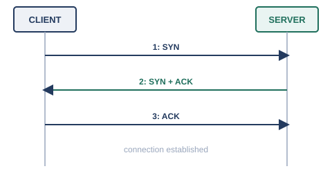
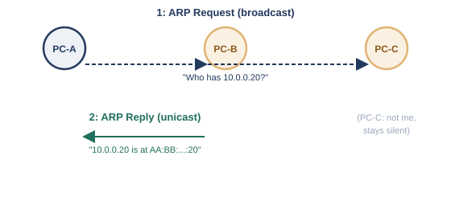

# 第7章　トランスポート層

## 7.1　サービスごとの「窓口」を区別する必要性 ― ポートという発想

IPアドレスが「どの機器（ホスト）宛てか」を示すのに対し、ポート番号は「その機器の中の、どのサービス宛てか」を区別するための番号です。

序章では、ファイル保管・印刷取りまとめなど、複数のサービスが貴重なサーバー1台にまとめられていく様子を見てきました。ここで新しい問題が生まれます。1台のサーバーが、Webサービスとメールサービスを同時に提供しているとき、届いた通信をどちらのサービス向けか、どうやって区別すればよいのでしょうか。

IPアドレスだけでは、この区別はできません。IPアドレスが指し示せるのは「どの機器か」までで、「その機器の中のどのプログラム（サービス）宛てか」までは指し示せないからです。そこで生まれたのが、ポート番号という「窓口」の発想です。同じ機器の中に、サービスの数だけ窓口を用意しておき、通信の宛先としてIPアドレスとポート番号をセットで指定することで、「どの機器の、どのサービス宛てか」を一意に表せるようになります。

#### IPアドレスとポート番号の役割分担

- IPアドレス: 通信の相手が「どの機器か」を指し示す
- ポート番号: その機器の中で、通信が「どのサービス（プログラム）宛てか」を指し示す
- この2つを組み合わせることで、初めて「特定の機器の、特定のサービス」と通信できる

このポート番号を管理し、実際に窓口を開いたり閉じたりする役割を担うのが、この章のテーマであるトランスポート層（L4）です。

## 7.2　TCPとUDPの違い

TCPは、届いたかどうかを保証し、順番も正しく並べ直してくれる信頼性重視のプロトコルで、UDPは、その保証を持たない代わりに軽量・高速なプロトコルです。

トランスポート層の代表的なプロトコルには、TCP（Transmission Control Protocol）とUDP（User Datagram Protocol）の2種類があります。TCPは、送ったデータが確実に届いたことを相手からの確認応答で確かめ、届いていなければ再送し、複数に分割されたデータも送信順に並べ直して渡す、という信頼性重視の設計になっています※1。一方のUDPは、こうした確認や並べ直しの仕組みを持たず、送りっぱなしにする代わりに、余計な手続きがない分、処理が軽くて速いという特徴があります※2。

#### TCPとUDPの使い分け

- TCP: Webページの閲覧、メールの送受信、ファイル転送など、データが1バイトも欠けたり順番が入れ替わったりしては困る用途
- UDP: 動画・音声のストリーミング、オンラインゲーム、DNSの問い合わせなど、多少の欠落より速さや低遅延を優先したい用途

「信頼性が高いTCPだけを使えばよいのでは」と思うかもしれませんが、確認や再送のやり取りにはそのぶん時間がかかります。リアルタイム性が求められる通話や配信では、多少データが欠けても、待たされるよりはそのまま再生を続けたほうが体験がよいことも多く、あえてUDPが選ばれます。どちらが優れているというより、通信の性質に応じた使い分けです。

## 7.3　ポート番号

ポート番号は16ビットの数値で、0〜1023番の「よく知られたポート」、1024〜49151番の「登録済みポート」、49152〜65535番の「動的・一時的なポート」の3つの範囲に分かれています。

ポート番号は16ビットの数値で、0番から65535番までの範囲を取ります。IANA（Internet Assigned Numbers Authority）が、この範囲を3つの区分に分けて管理しています※3。

#### ポート番号の3つの区分

- 0〜1023番（よく知られたポート、Well Known Ports）: HTTPの80番、HTTPSの443番、SSHの22番、DNSの53番など、広く使われる主要サービスに割り当てられる
- 1024〜49151番（登録済みポート、Registered Ports）: 特定のアプリケーション・サービス向けにIANAへ登録申請できる範囲
- 49152〜65535番（動的・一時的なポート、Dynamic/Ephemeral Ports）: クライアント側が通信のたびに一時的に使う、割り当て不要の範囲

普段、Webブラウザでサイトを閲覧するとき、サーバー側は80番や443番といった決まったポートで待ち受けていますが、クライアント側（自分のPC）は、通信のたびに動的・一時的なポートの範囲からランダムに1つを選んで使っています。この「サーバー側は決まった窓口番号で待ち、クライアント側はその都度空いている窓口を使う」という非対称な関係も、ポート番号の実際の使われ方を理解するうえで押さえておきたいポイントです。

クラウドのネットワークセキュリティグループ（NSG）やセキュリティグループでフィルタ設定をするとき、TCP/UDPとポート番号（80番、443番など）を指定するのは、まさにこのポート番号の仕組みをそのまま使っています。また、クラウドのNATゲートウェイ（NAT自体の仕組みは第8章で扱います）では、多数の送信元機器が動的・一時的なポートを奪い合う結果、「ポートが枯渇してそれ以上新しい通信を開始できない」という実務上の問題が起こることがあり、ポート番号が有限の資源であることを意識させられる場面の1つです。

## 7.4　TCPの通信手順（3ウェイハンドシェイク）

TCPは通信を始める前に、SYN・SYN+ACK・ACKという3回のやり取りで、お互いに「これから通信を始めます」という合意を取り交わします。

TCPが信頼性を保証できる理由の1つが、本格的なデータのやり取りを始める前に、必ず接続を確立する手続きを踏む点にあります。この手続きは、3回のやり取りから成るため、3ウェイハンドシェイクと呼ばれています※1。

<figure>

<figcaption>3ウェイハンドシェイク: SYN → SYN+ACK → ACK</figcaption>
</figure>

#### 3ウェイハンドシェイクの流れ

- 1回目（SYN）: クライアントがサーバーに「接続を始めたい」という信号を送る
- 2回目（SYN+ACK）: サーバーが「了解した、こちらも接続を始めたい」と、受諾と自分からの要求を同時に返す
- 3回目（ACK）: クライアントが「了解した」と応答し、ここで両者の接続が確立する

この手続きによって、お互いが「相手が確かに存在し、通信を受け付ける準備ができている」ことを確認してから、本題のデータをやり取りできます。通信が終わるときにも、今度は双方向でFIN（終了要求）とACKを交わし合い、双方が合意のうえで接続を終了させる手順が定められています。

## 7.5　ARPとICMP

ARPとICMPは、厳密にはトランスポート層のプロトコルではありませんが、通信の診断・補助という役割から、この章でまとめて紹介します。

ここまでトランスポート層の話をしてきましたが、ARPとICMPは、第1章で見たOSI参照モデルのどの層にもすっきり収まる存在ではありません。ARPはIPアドレスとMACアドレスを橋渡しする、L2とL3の間の実務的な仕組みであり、ICMPはIPそのものの一部として動くL3寄りの仕組みです。どちらも「通信そのものを届ける」役割ではなく、「通信を成立させるための下準備をする」「通信の状態を診断する」という、縁の下の役割を担っているという共通点から、本書ではこの章にまとめて置いています。

#### ARP・ICMPの位置づけ

- ARP（Address Resolution Protocol）: IPアドレスから対応するMACアドレスを調べる、L2/L3の橋渡し役
- ICMP（Internet Control Message Protocol）: 通信の成否やエラーを報告する、IPに付随する診断・補助の仕組み

第4章では、ARPを「IPアドレスから、対応するMACアドレスを問い合わせる仕組み」として概念的に紹介しました。ここで、その具体的な手順を見ていきます。

<figure>

<figcaption>ARP: ブロードキャストで問い合わせ、該当する機器だけがユニキャストで応答する</figcaption>
</figure>

ARPは1982年にRFC 826として標準化されています※4。ある機器が、同じネットワーク内の別の機器のMACアドレスを知りたいとき、「このIPアドレスを持っているのはどなたですか」という問い合わせ（ARP Request）を、同じネットワーク内の全機器へブロードキャストで送ります。該当するIPアドレスを持つ機器だけが、「わたしです、MACアドレスはこれです」という応答（ARP Reply）を、問い合わせ元へユニキャスト（1対1）で返します。この問い合わせと応答の結果は、ARPテーブル（ARPキャッシュ）としてしばらくの間手元に保存されるため、同じ相手に何度も問い合わせる必要はありません。

ICMPは、IPパケットが正しく届いたかどうかや、途中で何か問題が起きていないかを報告するための仕組みで、1981年にRFC 792として標準化されています※5。日常的によく使われる`ping`コマンドは、ICMPのエコー要求（Echo Request）を相手に送り、エコー応答（Echo Reply）が返ってくるかどうかで、相手との疎通を確認する仕組みです。また、`traceroute`（`tracert`）コマンドは、パケットの生存時間（TTL）を1ずつ増やしながら送り、途中の各ルータから返される「時間切れ」のICMPメッセージを利用して、宛先までの経路上のルータを1台ずつ明らかにする、という応用的な使い方をしています。

## 参考文献

- ※1: RFC 9293, *Transmission Control Protocol (TCP)* — https://www.rfc-editor.org/rfc/rfc9293.html
- ※2: RFC 768, *User Datagram Protocol* — https://www.rfc-editor.org/rfc/rfc768.html
- ※3: RFC 6335, *Internet Assigned Numbers Authority (IANA) Procedures for the Management of the Service Name and Transport Protocol Port Number Registry* — https://www.rfc-editor.org/rfc/rfc6335.html
- ※4: RFC 826, *An Ethernet Address Resolution Protocol* — https://www.rfc-editor.org/rfc/rfc826.html
- ※5: RFC 792, *Internet Control Message Protocol* — https://www.rfc-editor.org/rfc/rfc792.html

