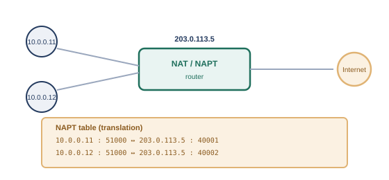

# 第8章　アクセス制御とNAT

## 8.1　ACLという考え方

ACL（Access Control List、アクセス制御リスト）は、「どの通信を許可し、どの通信を拒否するか」をルールの並びとして定義し、ルータやファイアウォールに適用する仕組みです。

序章では、組織同士がネットワークでつながるようになると、「入れたくない相手を締め出す」という新しい悩みが生まれる様子を見てきました。つながること自体は便利ですが、あらゆる通信を無条件に受け入れてしまうと、悪意のある通信も素通りしてしまいます。そこで生まれたのが、通信を選別するという発想です。

ACLは、送信元IPアドレス・宛先IPアドレス・プロトコル（TCP/UDPなど）・ポート番号といった条件をもとに、「この条件に一致する通信は許可（permit）」「この条件に一致する通信は拒否（deny）」というルールを、上から順に並べたリストです。ルータやファイアウォールは、届いた通信を上から順にルールと照合し、最初に一致したルールに従って通信を通すか止めるかを決めます。

#### ACLの基本的な考え方

- ルールは上から順に評価され、最初に一致したルールが適用される（それより下のルールは評価されない）
- 明示的にどのルールにも一致しなかった通信は、多くの実装で暗黙的に拒否される
- 送信元/宛先IPアドレス、プロトコル、ポート番号などを条件として組み合わせられる

ここで注意が必要なのは、伝統的なACLの多くは、通信の「行き」と「帰り」を自動的には結び付けてくれない、ステートレス（状態を持たない）な仕組みだという点です。たとえば、社内からWebサーバへのアクセスを許可するルールを作っただけでは不十分で、その応答（帰りの通信）を許可するルールも別途用意しないと、通信が成立しません。これに対し、現代のファイアウォールの多くは、「行きの通信を許可すれば、対応する帰りの通信は自動的に許可する」というステートフル（状態を保持する）な処理を備えており、設定の手間と安全性の両方が改善されています。

## 8.2　NAT/NAPTの仕組み

NATは、プライベートIPアドレスとグローバルIPアドレスを変換する仕組みで、NAPTは、その変換にポート番号も組み合わせることで、複数の機器が1つのグローバルIPアドレスを共有できるようにする仕組みです。

第4章では、`192.168.x.x`や`10.x.x.x`といったプライベートIPアドレスが、インターネットには直接ルーティングされないという話をしました。では、プライベートIPアドレスを持つ社内の機器は、どうやってインターネット上のサーバと通信しているのでしょうか。ここで働いているのが、NAT（Network Address Translation、ネットワークアドレス変換）です※1。

NATには、大きく分けて2つの方式があります。1つは、プライベートIPアドレス1つに対して、グローバルIPアドレス1つを対応させるだけの、単純なNAT（Basic NAT）です。もう1つは、第7章で見たポート番号も組み合わせて変換する、NAPT（Network Address Port Translation）※1で、「IPマスカレード」とも呼ばれます。

<figure>

<figcaption>NAPT: 複数のプライベートIPアドレスを、ポート番号込みで1つのグローバルIPアドレスに変換する（同じローカルポート51000同士も、グローバル側では別ポートに割り当てて衝突を解決する）</figcaption>
</figure>

NAPTでは、社内の機器がインターネットへ通信するたびに、「どのプライベートIPアドレス・ポート番号の組み合わせが、グローバル側のどのポート番号に対応しているか」という変換テーブルを、NATルータが動的に作成・管理します。この仕組みのおかげで、限られた数（多くの場合1個）のグローバルIPアドレスだけで、社内の多数の機器が同時にインターネットへアクセスできるようになります。

## 8.3　豆知識：アドレス枯渇とCGNAT（読み飛ばし可）

IPv4アドレスは有限であり、世界的な枯渇に対応するため、通信事業者が加入者宅とインターネットの間にもう1段階のNATを挟む、CGNAT（Carrier-Grade NAT）という仕組みが使われることがあります。

IPv4アドレスは32ビットの数値なので、表現できる組み合わせは約43億個しかありません。インターネットに接続する機器が世界的に増え続けた結果、この数では足りなくなる「IPv4アドレス枯渇」が現実の問題になりました。

NAPTによって、1つのグローバルIPアドレスを社内の多数の機器で共有できるようになりましたが、それでも「1契約に1つのグローバルIPアドレス」を割り当てるだけの数が、通信事業者側で足りなくなってきています。そこで登場したのが、CGNAT（Carrier-Grade NAT、キャリアグレードNAT）です。CGNATは、契約者の自宅ルータとインターネットの間に、通信事業者がもう1段階のNATを挟むことで、複数の契約者に、同じグローバルIPアドレスを（ポート番号を分け合う形で）共有させる仕組みです。契約者宅のルータとCGNAT設備の間では、`100.64.0.0/10`という、CGNAT専用に予約された共有アドレス空間が使われます※2。

CGNATは、枯渇問題への現実的な対処法である一方、契約者側からは「NATの中に、さらにNATがある」状態になるため、外部から契約者の機器へ直接アクセスする（特定のポート宛ての通信を外部から通せるようにする、いわゆるポート開放をする）ことが難しくなる、という副作用もあります。

クラウドのNSG（ネットワークセキュリティグループ）やセキュリティグループは、まさにこの章で見たステートフルなACLそのものです。インバウンドルールを1つ許可すれば、対応するアウトバウンドの応答は自動的に通過が許可される、という動作は、伝統的なステートレスACLとの違いとして意識しておくとよいでしょう。また、クラウド上の仮想マシンにグローバルIPアドレスを直接持たせず、ロードバランサやNATゲートウェイ経由でインターネットに出す構成も、この章で見たNAT/NAPTの考え方の延長線上にあります。

## 参考文献

- ※1: RFC 3022, *Traditional IP Network Address Translator (Traditional NAT)* — https://www.rfc-editor.org/rfc/rfc3022.html
- ※2: RFC 6598, *IANA-Reserved IPv4 Prefix for Shared Address Space* — https://www.rfc-editor.org/rfc/rfc6598.html

