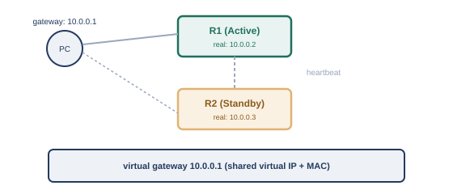
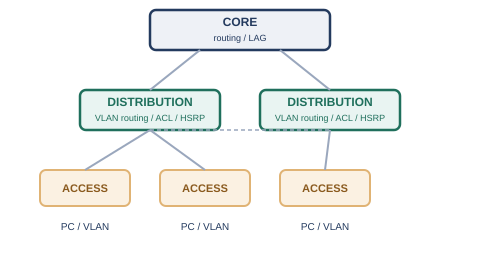

# 第9章　冗長化

## 9.1　冗長化はなぜ必要か

冗長化とは、通信経路や機器を複数用意しておくことで、そのうち1つが故障しても、全体としては通信が止まらないようにする設計のことです。

ここまでの章では、スイッチ・ルータ・ケーブルといった機器や配線が、正しく動いていることを前提に話を進めてきました。しかし、どんな機器やケーブルも、いつかは故障します。1台のスイッチ、1本のケーブル、1台のルータだけに頼った構成では、その1点が壊れただけで、ネットワーク全体、あるいはその先につながる利用者全員が影響を受けてしまいます。このような、そこが壊れると全体が止まってしまう1点のことを、単一障害点（SPOF、Single Point of Failure）と呼びます。

第3章では、スイッチ同士を複数のケーブルでループ状につなぐと、STP（スパニングツリープロトコル）によって、普段は使わない予備の経路を用意しつつ、論理的にはループのない状態を保つ仕組みを見ました。これは、L2における冗長化の一例です。この章では、L3（デフォルトゲートウェイ）や、物理的なリンクそのものについても、同じように「複数用意しておいて、1つが壊れても大丈夫にする」という発想を広げていきます。

## 9.2　HSRP/VRRPの仕組みと目的（ハートビート、無停止交換の実務価値）

HSRPやVRRPは、複数台のルータで1つの仮想的なデフォルトゲートウェイを共有し、実際に動いているルータが故障しても、機器側の設定を変えずに通信を継続できるようにする仕組みです。

第4章・第5章で見たように、機器はデフォルトゲートウェイのIPアドレスを1つだけ設定として持ちます。もし、そのデフォルトゲートウェイとして動いているルータが1台だけだと、そのルータが故障した瞬間に、社内から外へ出る通信がすべて止まってしまいます。かといって、機器ごとに「ルータAが落ちたらルータBに手動で設定を変える」というのは現実的ではありません。

そこで使われるのが、HSRP（Hot Standby Router Protocol）やVRRP（Virtual Router Redundancy Protocol）といった、FHRP（First Hop Redundancy Protocol、最初のホップの冗長化プロトコル）です。HSRPはCisco社が開発した方式でRFC 2281として文書化されており※1、VRRPはIETFが標準化した方式で、現行版はRFC 9568です※2。

#### HSRP/VRRPの仕組み

- 複数台のルータが、共有の仮想IPアドレス・仮想MACアドレスを持つ「仮想ルータ」を演じる
- 機器側のデフォルトゲートウェイには、この仮想IPアドレスだけを設定しておく
- 参加するルータの間では、ハートビート（生存確認のための短い間隔のメッセージ）が定期的にやり取りされ、転送を担当するルータが動いているかどうかが監視される
- 実際に転送を担当するルータ（アクティブ/マスター）が応答しなくなると、待機していたルータ（スタンバイ/バックアップ）が仮想IPアドレス・仮想MACアドレスを引き継ぎ、転送を肩代わりする

<figure>

<figcaption>2台のルータが仮想的な1つのデフォルトゲートウェイを演じる</figcaption>
</figure>

この仕組みの実務上の価値は、故障時の自動切り替えだけにとどまりません。たとえば、ルータのソフトウェア更新やハードウェア交換をしたいとき、アクティブ側を意図的にスタンバイへ切り替えてから作業すれば、機器側には何の設定変更もさせずに、無停止（またはごく短時間の停止）でメンテナンスを行えます。これは、日々の運用の中で地味ながら大きな価値を持つ使い方です。

## 9.3　LAGの仕組みと「同一論理スイッチ内限定」の罠

LAG（Link Aggregation Group）は、複数の物理リンクを束ねて1本の論理リンクとして扱う技術で、帯域の拡大と、リンク単位での冗長化の両方を実現します。

第3章で触れたように、機器同士を複数のケーブルでつなぐこと自体は、冗長化の基本形です。ただし、単純にケーブルを複数本つなぐだけでは、L2スイッチはループとみなしてSTPでブロッキングしてしまい、せっかくの複数本のうち1本しか実際には使われません。そこで、複数の物理リンクを、あたかも1本の太い論理リンクであるかのように束ねる技術が、LAGです。IEEE 802.1AXとして標準化されており※3、実際にリンクを束ねる制御にはLACP（Link Aggregation Control Protocol）というプロトコルが使われます。

#### LAGが持つ2つの効果

- 帯域の拡大: 束ねた本数分、理論上の合計帯域が増える
- リンク単位の冗長化: 束ねた中の1本が切れても、残りのリンクで通信を継続できる（STPのブロッキングによる切り替えより高速）

ここで注意したいのが、伝統的なLAGは「1台の機器と、もう1台の機器」という、ちょうど2台のペアの間でしか組めない、という制約です。つまり、スイッチAから出た複数本のケーブルを束ねてLAGにする場合、その先はすべて「スイッチB」という同一の1台（に見える論理的な単位）につながっていなければなりません。スイッチAから出た複数本のケーブルを、物理的に別々の2台のスイッチ（スイッチBとスイッチC）に分けて、それでも1つのLAGとして扱う、ということは、伝統的なLAGの仕組みだけでは実現できないのです。

この制約を乗り越えるために、複数の物理スイッチを、LAGの相手から見て「1台の論理スイッチ」であるかのように振る舞わせる技術（スタッキング、MC-LAGやvPCなど、メーカーによって呼び方が異なる仕組み）が使われることがあります。これにより、スイッチ本体そのものが1台丸ごと故障しても、LAGを組んだ相手から見れば「複数本のうちの何本かが切れただけ」として扱われ、通信を継続できるようになります。「LAGを組んでいるから安心」と思っていても、実はその先が物理的に1台のスイッチに集約されている、という構成では、そのスイッチ自体の故障がSPOFのまま残ってしまう、という点は見落としやすい罠です。

## 9.4　まとめ：2層・3層ネットワークアーキテクチャという設計の型

第3章から本章までで積み上げてきた要素は、アクセス層・ディストリビューション層・コア層という階層に機器を配置する、2層・3層ネットワークアーキテクチャという定番の設計の型に集約されます。

第3章のスイッチングから始まり、IPアドレス、ルーティング、VLAN、トランスポート層、ACL/NAT、そしてこの章の冗長化まで、ここまでの内容を振り返ってみましょう。実際の企業ネットワークでは、これらの要素は、大きく3つの階層に整理されるのが一般的です。

#### 3層ネットワークアーキテクチャの各層

- アクセス層: PCやサーバーなど末端の機器が実際に接続される層（第3章のスイッチ、第6章のVLAN）
- ディストリビューション層: 複数のアクセス層スイッチを集約し、VLAN間ルーティング（第6章）やACL（第8章）によるポリシー適用を行う層。多くの場合、この層の機器がHSRP/VRRP（本章）でデフォルトゲートウェイの冗長化を担う
- コア層: ディストリビューション層同士を高速に結ぶ、ネットワークの背骨にあたる層。第5章のルーティングプロトコルや、本章のLAGによる高速な経路切り替えが重要になる

<figure>

<figcaption>3層ネットワークアーキテクチャ: コア → ディストリビューション → アクセス</figcaption>
</figure>

小規模なネットワークでは、ディストリビューション層とコア層を1つにまとめた2層構成が使われることも多く、規模や要件に応じて、この型は柔軟に使い分けられます。いずれにしても、「末端の接続」「ポリシーの適用」「高速な中継」という役割を階層として分離し、各階層・各機器を冗長化しておく、という設計の型そのものは共通しています。

ここまでの章で見てきた要素を、この3層構造に当てはめて振り返ってみましょう。第3章のMACアドレステーブルとコリジョンドメインはアクセス層の基礎、第4章・第5章のIPアドレスとルーティングはディストリビューション層・コア層をまたぐ通信の基盤、第6章のVLANはアクセス層〜ディストリビューション層の論理分割、第7章のポート番号はエンドツーエンドの通信を成立させる最後のピース、第8章のACL/NATはディストリビューション層でのポリシー適用の実例、そして本章の冗長化は、これら全部の層に共通して求められる「壊れても止まらない」ための設計です。個々の技術要素がバラバラに存在するのではなく、この階層構造の中でどう組み合わさるかを意識すると、実際のネットワーク構成図の見え方が大きく変わってきます。

クラウドの世界では、物理的な機器の冗長化に相当する考え方が、アベイラビリティゾーン（AZ、独立した1つ以上のデータセンターからなる単位）への分散という形で現れます。1つのAZが丸ごと使えなくなっても、別のAZに同じ構成のリソースを用意しておけば、サービス全体は継続できます。また、ロードバランサは、この章で見たHSRP/VRRPと似た役割を果たします。利用者は常に1つの窓口（ロードバランサのアドレス）にアクセスするだけで、背後にある複数のサーバーのうちどれが実際に応答しているかを意識する必要がありません。オンプレミスの「仮想ゲートウェイを複数台のルータで演じる」という発想と、クラウドの「複数台のサーバーを1つの窓口の背後に隠す」という発想は、根底にある考え方が共通しています。

## 参考文献

- ※1: RFC 2281, *Cisco Hot Standby Router Protocol (HSRP)* — https://www.rfc-editor.org/rfc/rfc2281.html
- ※2: RFC 9568, *Virtual Router Redundancy Protocol (VRRP) Version 3 for IPv4 and IPv6* — https://www.rfc-editor.org/rfc/rfc9568.html
- ※3: IEEE 802.1AX-2020, *IEEE Standard for Local and Metropolitan Area Networks—Link Aggregation* — https://standards.ieee.org/ieee/802.1AX/6768/

