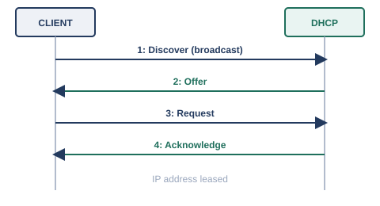
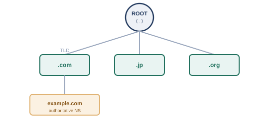

# 第10章　DHCPとDNS

## 幕間　名前を教え合う話

小さな組織の中でネットワークを使い始めた頃は、機器の数もそれほど多くありません。「このIPアドレスはファイルサーバー」「あのIPアドレスは経理部の複合機」といった対応関係は、機器を管理している数人が頭の中で覚えているか、せいぜい1枚の一覧表を共有しておけば十分でした。実際、コンピュータ自身も、`hosts`ファイルと呼ばれる簡単な対応表を手元に持たせておくだけで、名前とIPアドレスの対応づけを済ませることができました。

しかし、組織の外にある無数のコンピュータともやり取りしたい、という段階になると、この方法は破綻します。世界中の誰かがサーバーを新設したり、IPアドレスを変更したりするたびに、全世界のコンピュータが持つ一覧表を更新して回ることなど、到底できません。この問題を解決するために生まれたのが、この章の後半で見ていくDNSと、その頂点に立つルートサーバー群です。

まずは、IPアドレスという番号そのものを、機器に自動的に配り届ける仕組みから見ていきましょう。

## 10.1　DHCP

DHCP（Dynamic Host Configuration Protocol）は、ネットワークに接続した機器に対して、IPアドレスやデフォルトゲートウェイなどの設定情報を自動的に配布する仕組みです。

第4章で見てきたIPアドレスやデフォルトゲートウェイは、本来、機器ごとに手作業で設定する必要があります。しかし、社内に何百台もの機器があるとき、1台ずつ手作業でIPアドレスを設定して回るのは非現実的ですし、設定ミスによるIPアドレスの重複も起こりやすくなります。この問題を解決するのが、DHCPです。RFC 2131として標準化されています※1。

#### DHCPが自動配布する主な情報

- IPアドレスとサブネットマスク（第4章）
- デフォルトゲートウェイのIPアドレス（第4章）
- DNSサーバーのIPアドレス（この章の後半で扱います）

DHCPによるIPアドレスの取得は、4段階のやり取りで行われ、それぞれの頭文字を取ってDORA（Discover, Offer, Request, Acknowledge）と呼ばれています。

<figure>

<figcaption>DHCPのDORAプロセス</figcaption>
</figure>

#### DORAプロセスの流れ

- Discover: クライアントが「DHCPサーバーはいませんか」とブロードキャストで問いかける
- Offer: DHCPサーバーが「このIPアドレスを使えます」と提案を返す
- Request: クライアントが「その提案のIPアドレスをください」と要求する
- Acknowledge: DHCPサーバーが割り当てを確定し、クライアントがそのIPアドレスを使い始める

配布されたIPアドレスには、多くの場合「リース期間」という有効期限が設定されており、期限が近づくとクライアントは同じDHCPサーバーに更新を依頼します。機器がネットワークから長期間離れるなどして更新されなければ、そのIPアドレスは他の機器に再利用できる状態に戻ります。

## 10.2　豆知識：家庭のPPPoE（自宅ルータで簡単に確認できる）

PPPoE（PPP over Ethernet）は、家庭のインターネット回線でよく使われる、イーサネット上でPPPというプロトコルを動かし、通信事業者との間で認証・接続を確立する仕組みです。

自宅のインターネット回線、特に光回線やDSL回線では、ルータの設定画面に「PPPoE接続」という項目や、プロバイダから渡された「ID」「パスワード」を入力する欄があることがあります。これは、電話回線の時代からあったPPP（Point-to-Point Protocol）という1対1の接続を確立するための仕組みを、イーサネット（第2章・第3章で見たLANの技術）の上で動かせるようにしたもので、RFC 2516として標準化されています※2。

家庭のルータは、この認証情報をもとにプロバイダ側の設備とPPPoEセッションを確立し、そのセッションを通じてグローバルIPアドレスなどの情報を受け取ります。自宅のルータの設定画面を開くと、この章で扱ったDHCP（ルータから宅内の機器への配布）とPPPoE（ルータからプロバイダへの接続）という、2種類の異なる仕組みが同時に動いている様子を、実際に確認できることがあります。

## 10.3　hostsファイルから外部参照、そしてルートDNSへ

組織の外にある無数のコンピュータの名前を、1枚の対応表で管理することは不可能なため、名前の管理を階層的に分担する仕組みとして、DNS（Domain Name System）が生まれました。

インターネットの黎明期には、接続されているすべてのコンピュータの名前とIPアドレスの対応関係を1つのファイル（`HOSTS.TXT`）にまとめ、それを定期的に配布するという運用がとられていました。しかし、接続されるコンピュータの数が増えるにつれて、この方法には無理が生じてきます。更新が反映されるまでの遅延、ファイルサイズの肥大化、そして何より、世界中の変更を1か所で管理すること自体の限界です。

この課題を解決するために設計されたのが、DNS（Domain Name System）です。DNSは、名前の管理を「誰か1人がすべて把握する」のではなく、階層構造に分割し、それぞれの階層を別々の管理者が分担する、という発想に基づいています。全体的な概念や仕組みはRFC 1034※3、具体的なデータ形式や実装はRFC 1035※4として標準化されています。

<figure>

<figcaption>DNSの階層構造: ルート → トップレベルドメイン → 個別ドメイン</figcaption>
</figure>

この階層の頂点に立つのが、ルートサーバーです。ルートサーバーは、末端のドメイン名そのものを知っているわけではなく、「`.com`について知りたければ、こちらのサーバーに聞いてください」というように、次に問い合わせるべき先を案内する役割を担っています。この階層を、ルート→トップレベルドメイン（`.com`、`.jp`など）→個別のドメイン、とたどっていくことで、世界中のどの名前についても、最終的には正しい答えにたどり着けるようになっています。

## 10.4　DNSの仕組み

利用者の代わりに階層を順にたどって名前を解決してくれる「フルサービスリゾルバ」と、答えを一定期間覚えておくキャッシュの仕組みによって、DNSは日々の通信を裏で支えています。

わたしたちが普段、Webブラウザにドメイン名を入力したとき、実際には次のような流れで名前が解決されています。

#### 名前解決の流れ（概略）

- 手元の機器は、まず「フルサービスリゾルバ」（多くの場合、ISPやDHCPで指定されたDNSサーバー）に問い合わせる
- フルサービスリゾルバは、必要に応じてルートサーバー→トップレベルドメインのサーバー→個別ドメインの権威サーバー、と順に問い合わせを重ね（反復問い合わせ）、最終的な答えを手元の機器に返す
- 一度解決した結果は、一定時間（TTL、Time To Live）だけフルサービスリゾルバ側に記憶（キャッシュ）され、同じ問い合わせが来てもすぐに答えられるようにする（第7章のパケットのTTLとは名前が同じだけで別の仕組みです。こちらはDNSレコードごとにキャッシュを保持しておく時間を指します）

このキャッシュの仕組みのおかげで、世界中の利用者が同じ人気サイトへアクセスするたびに、いちいちルートサーバーまで問い合わせが飛ぶ、という事態が避けられています。また、DNSの問い合わせは、多くの場合、第7章で見たUDPの53番ポートを使って行われます。1回のやり取りで完結する軽量な問い合わせという性質上、コネクションを確立する手間のかかるTCPよりも、UDPのほうが向いているためです（大きな応答データを扱う場合など、一部の状況ではTCPも使われます）。

クラウド環境では、この章で見たDHCPとDNSのどちらも、専用のマネージドサービスとして提供されているのが一般的です。仮想ネットワーク（VPC）ごとに「DHCPオプションセット」（AWSでの呼び方。Azure/GCPでは仮想ネットワークのDNS設定として同様の機能が提供されます）を指定すると、そのネットワーク内の機器に配布するDNSサーバーのアドレスやドメイン名をまとめて設定できますし、Amazon Route 53やAzure DNS、Cloud DNSといったマネージドDNSサービスを使えば、自前でDNSサーバーを構築・運用しなくても、権威DNSサーバーとしての機能を利用できます。オンプレミス環境とクラウド環境の両方に名前解決の仕組みがある場合には、双方を橋渡しするハイブリッドDNS（クラウド側のリゾルバ経由でオンプレミスのドメインも解決できるようにする構成など）も使われます。

## 参考文献

- ※1: RFC 2131, *Dynamic Host Configuration Protocol* — https://www.rfc-editor.org/rfc/rfc2131.html
- ※2: RFC 2516, *A Method for Transmitting PPP Over Ethernet (PPPoE)* — https://www.rfc-editor.org/rfc/rfc2516.html
- ※3: RFC 1034, *Domain Names - Concepts and Facilities* — https://www.rfc-editor.org/rfc/rfc1034.html
- ※4: RFC 1035, *Domain Names - Implementation and Specification* — https://www.rfc-editor.org/rfc/rfc1035.html

