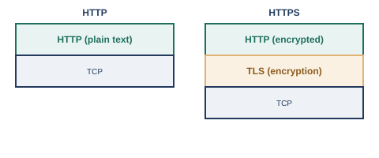

# 第11章　アプリケーション層のサービス

## 11.1　HTTPとHTTPS

HTTPはWebページをやり取りするための取り決めで、HTTPSは、そのHTTPの通信をTLSという仕組みで暗号化したものです。

ここまでの章で見てきたIPアドレス・ポート番号・TCP/UDPは、いずれも「通信を届けるための仕組み」でした。この章で扱うのは、その届いた通信の中身として、実際にどんなやり取りが行われているか、というアプリケーション層（L7）のサービスです。

その代表格が、Webページの閲覧に使われるHTTP（HyperText Transfer Protocol）です。HTTPは、ブラウザ（クライアント）が「このページをください」というリクエストを送り、Webサーバーが該当するデータをレスポンスとして返す、という単純なリクエスト・レスポンス形式で成り立っています。現行の仕様はRFC 9110としてまとめられています※1。

#### HTTPとHTTPSの違い

- HTTP: リクエスト・レスポンスの中身がそのまま（平文で）流れる
- HTTPS: TLS（Transport Layer Security）という暗号化の仕組みでHTTPの通信全体を包み、途中で盗み見られても内容が読めないようにする

<figure>

<figcaption>HTTPSは、TCPとHTTPの間にTLSという暗号化の層を挟む</figcaption>
</figure>

現行のTLSの仕様はRFC 9846としてまとめられています※2。銀行やショッピングサイトはもちろん、現在では大半のWebサイトが、通信内容を保護するためにHTTPSを使うようになっています。

なお、近年では、HTTP/3という新しいバージョンも登場しています。これまでのHTTPはTCPの上で動いていましたが、HTTP/3は、QUICと呼ばれるUDPベースの新しいトランスポートの上で動作します（RFC 9114）※3。接続確立の速度や、パケット損失時の挙動の改善が主な狙いですが、輻輳制御などの詳細な仕組みは本書の範囲を超えるため、「そういう新しい方式がある」という程度にとどめておきます。

## 11.2　SSH

SSH（Secure Shell）は、離れた場所にある機器に安全にログインし、操作するための仕組みです。

ネットワーク機器やサーバーの多くは、直接その場で操作するのではなく、離れた場所からリモートで管理・操作されます。かつては、telnetという仕組みがよく使われていましたが、telnetはユーザー名やパスワード、操作内容がすべて平文で流れてしまうため、盗聴のリスクがありました。

この問題を解決するために作られたのが、SSHです。通信内容を暗号化したうえで、リモートの機器にログインし、コマンドを実行できるようにします。RFC 4251としてプロトコルの全体構成が標準化されています※4。今日では、ルータやスイッチ、サーバーへのリモートログインの手段として、SSHが事実上の標準になっており、telnetは特別な事情がない限り使われなくなっています。

## 11.3　その他のサービス（メール、FTP、プロキシは概要のみ）

メールの送受信、ファイル転送、プロキシサーバーも、それぞれ専用のアプリケーション層のプロトコルによって成り立っています。

ここまで見てきたHTTP/HTTPS、SSHのほかにも、日常的に使われているアプリケーション層のサービスがいくつかあります。ここでは、深入りはせず、概要だけを押さえておきましょう。

#### その他の主なサービス

- メール: メールを送信する際にはSMTP（Simple Mail Transfer Protocol、RFC 5321）※5が、受信したメールをメールサーバーから取り出す際にはPOP3やIMAPといったプロトコルが使われる
- FTP（File Transfer Protocol）: ファイルを転送するための古くからある仕組み。制御用とデータ転送用に別々の接続を使う独特な構造を持つ
- プロキシ: クライアントとサーバーの間に立ち、通信を代理で中継する機器やソフトウェア。クライアント側の代理をする「フォワードプロキシ」（社内からインターネットへのアクセスを一括管理する用途など）と、サーバー側の代理をする「リバースプロキシ」（複数のサーバーへの負荷分散や、SSL/TLSの終端など）がある

これらのサービスも、結局のところ、この章の前半で見たHTTPやSSHと同じように、決まったポート番号（メール送信なら25番や587番、FTPなら20番・21番など）を使い、決まった手順でやり取りを行う、という点では共通しています。第7章で見たポート番号とトランスポート層の知識があれば、初めて見るアプリケーション層のプロトコルに出会っても、「このプロトコルは、どのポート番号で、どんな手順のやり取りをしているのか」という視点で読み解けるようになります。

クラウド環境では、この章で見た仕組みの多くが、マネージドサービスとして提供されています。ロードバランサー（ALB/NLBなど）にTLSの終端を任せ、証明書の発行・更新もACM（AWS Certificate Manager）のようなサービスに委ねれば、各サーバーが個別に証明書を管理する手間を減らせます。SSHについても、踏み台サーバーを直接インターネットに公開するかわりに、Session Manager（AWS Systems Manager）のような仕組みを使い、SSHの鍵管理・ポート開放そのものを不要にする構成も一般的になっています。また、この章で見たリバースプロキシの発想は、クラウドのAPI Gateway（複数のバックエンドサービスへのルーティングや認証をまとめて引き受ける仕組み）やCDN（コンテンツ配信ネットワーク）にも受け継がれています。

## 参考文献

- ※1: RFC 9110, *HTTP Semantics* — https://www.rfc-editor.org/rfc/rfc9110.html
- ※2: RFC 9846, *The Transport Layer Security (TLS) Protocol Version 1.3* — https://www.rfc-editor.org/rfc/rfc9846.html
- ※3: RFC 9114, *HTTP/3* — https://www.rfc-editor.org/rfc/rfc9114.html
- ※4: RFC 4251, *The Secure Shell (SSH) Protocol Architecture* — https://www.rfc-editor.org/rfc/rfc4251.html
- ※5: RFC 5321, *Simple Mail Transfer Protocol* — https://www.rfc-editor.org/rfc/rfc5321.html

