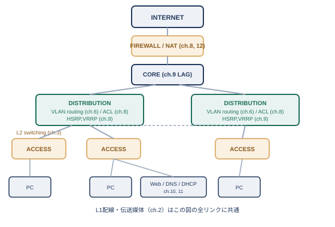

# 終章　学び直しの総括

## ここまでの振り返り

序章で1台のコンピュータから始まった旅は、機器同士をつなぐ物理層から、組織を越えて世界とつながるアプリケーション層まで、積み重なる階層をひとつずつたどる旅でした。

序章では、ハードウェアとソフトウェアの技術進歩、コストの最適化、複雑さと単純さの間を行き来しながら、ネットワークの歴史が形を変えてきた道のりを振り返りました。ここでは、その歴史の中で登場した技術要素が、この本の中でどう積み重なっていったかを、章をまたいで見渡してみましょう。

#### 積み上げてきた地図

- 物理層: ケーブルや電波で、0と1を届ける（第2章）
- データリンク層: 同じ配線の中で、MACアドレス宛てに届ける（第3章）、それを論理的に分割する（第6章のVLAN）
- ネットワーク層: 違うネットワーク同士をIPアドレスで結ぶ（第4章）、経路を選ぶ（第5章のルーティング）
- トランスポート層: どのアプリケーション宛てかを区別し、必要なら信頼性を保証する（第7章）
- アプリケーション層: 実際のサービスとしてやり取りする（第11章）
- 運用を支える技術: 通信を選別し守る（第8章のACL/NAT、第12章のセキュリティ）、止まらないようにする（第9章の冗長化）、自動化する（第10章のDHCP/DNS）

この本は、単に技術要素を年代順・階層順に並べただけではなく、各章の中に伏線と回収を仕込んできました。第3章の「ブロードキャストドメインを分割できるのはルータだけ」という断言が、第6章のVLANによってどんでん返しを迎えたように、ネットワークの世界では、ある層で「これしかできない」と思われていたことが、別の層の技術によって乗り越えられる、ということがよく起こります。この本を読み終えたいま、みなさんの頭の中には、個々の技術の知識だけでなく、それらがどうつながり合っているかという地図ができあがっているはずです。

## ワーク1　重ね合わせワーク

1つの小さな社内ネットワークの構成図を題材に、序章から積み上げてきた各層の登場人物を、1枚の図の上に重ね合わせて見直してみましょう。

次の図は、第9章で見た3層アーキテクチャをベースにした、ごく小規模な社内ネットワークの例です。この図の中に、この本で学んできた要素がどこに現れているかを、実際に指差しながら確認してみてください。

<figure>

<figcaption>この本で学んだ要素を、1つのネットワーク構成図に重ね合わせる</figcaption>
</figure>

- PCとアクセススイッチをつなぐケーブルは第2章（物理層）、そのフレームのやり取りは第3章（データリンク層）
- アクセススイッチ上でのVLANの区切りは第6章、ディストリビューション層でのVLAN間ルーティングは第6章と第4章・第5章の組み合わせ
- ディストリビューション層のHSRP/VRRPによる冗長化は第9章、ファイアウォールでのACL・NATは第8章
- インターネットとの通信で使われるポート番号・TCP/UDPは第7章、DHCPによるIPアドレスの自動配布とDNSによる名前解決は第10章
- Webサーバーへのアクセスやそこで動くHTTP/HTTPSは第11章、通信を暗号化するVPNやファイアウォールの内側の考え方は第12章

こうして見ると、たった1枚の小さな構成図の中に、この本のほぼすべての章が顔を出していることに気づくはずです。実際のネットワーク構成図を眺めるときも、同じように「これはどの層の話か」「どの章で学んだ技術か」を意識してみると、複雑に見える図も、いくつかの層に分解して理解できるようになります。

## ワーク2　設計思考ワーク

学んだ要素を組み合わせて、簡単な条件に沿ったネットワーク構成を、自分の手で設計してみましょう。

次のような条件を持つ、小さな会社のネットワークを設計するとしたら、みなさんならどう構成するでしょうか。

#### お題の条件（例）

- 部署は「営業」「開発」「総務」の3つがあり、それぞれ十数台のPCを使う
- 開発部門は、社外に公開するWebサーバーを1台、社内ネットワークとは別の区画で運用したい
- インターネット回線が1本しかなく、それが落ちると全社の業務が止まってしまうことが課題になっている
- 開発部門のPCから営業部門のPCへは、業務上アクセスできる必要はない

この条件だけを見ても、この本で学んだ技術の多くが、そのまま解決の糸口になることに気づくはずです。部署ごとの分離には第6章のVLANが、Webサーバーの隔離には第12章のDMZが、インターネット回線の単一障害点という課題には第9章の冗長化の考え方が、それぞれ対応します。正解は1つではありません。実際に紙やホワイトボードに構成図を描き、「なぜその構成にしたのか」を自分の言葉で説明できるところまで、一度試してみることをおすすめします。

## ワーク3　アウトプットの推奨

学んだ内容は、誰かに説明したり、文章として書き出したりすることで、初めて本当に自分のものになります。

この本を読み終えた後、ぜひ試してほしいのが、学んだ内容をアウトプットすることです。同僚に「VLANって何のためにあるの」と聞かれたときに、この本で見てきた「1台の機械の中に、複数の独立したネットワークがあるかのように見せかける」という発想を、自分の言葉で説明できるでしょうか。あるいは、ブログや社内Wikiに、この本で学んだ内容を自分なりに整理し直して書き出してみるのもよい方法です。

人に説明しようとすると、自分がどこを本当に理解していて、どこがまだ曖昧なままなのかが、驚くほどはっきりと見えてきます。そして、その曖昧さに気づいたときこそ、該当する章に戻って読み返す、良いタイミングです。ネットワークの学び直しは、この本を読み終えた瞬間に終わるのではなく、実際に手を動かし、人に説明し、また分からないことにぶつかる、というサイクルの中で、少しずつ続いていくものです。

